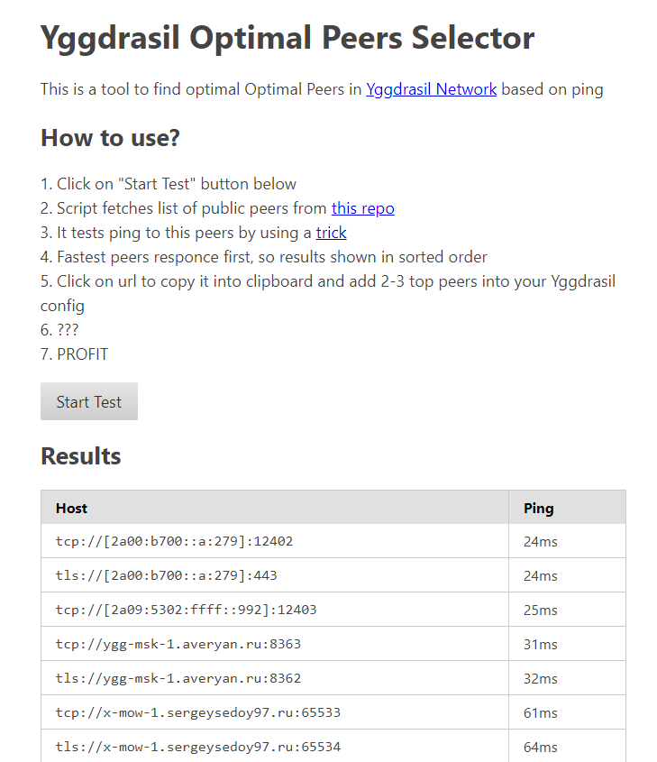

# Yggdrasil Optimal Peers Selector

**Tired of hunting down the best peers? Well, you're in luck - here's a tool just for you!**

Instead of manually checking the [list of public peers](https://publicpeers.neilalexander.dev) in the [Yggdrasil Network](https://yggdrasil-network.github.io) and guessing which ones are fast, simply use this tool to ping them and let it select the best peers based on response time.

Less hassle, more speed!

[Try a demo](https://cuamckuu.github.io/ygg-peers-selector.html)

# Why?

Here is kinda official explanation from Yggdrasil on peers selection:

> For the benefit of the wider network, please follow the below advice:
> - Select a small number of NEARBY peers with good uptime, preferably inside your own country or neighbouring countries only.
> - AVOID selecting peers that are high latency, i.e. because they are geographically far away from your node.
> - Do not add large numbers of peers from the list!

## How It Works?

- Get peers from github repo to avoid CORS
- Or get peers from peers list by using CORS proxy
- Imitate ping by trick with html image load

## TODO

- [X] Just working
- [X] Тable with results
- [X] One click peers copy
- [X] Sort table
- [ ] Hide textarea after copy
- [ ] Add title in head tag
- [ ] Use better url pattern `(?:quic|ws|tcp|tls|ws):\/\/(.+):\d+(?:\?.+)?`
- [ ] Show progress bar of test
- [ ] Better mobile view for wide table
- [ ] Add way to sharing results with url param
- [ ] Get uptimes from [peers list](https://publicpeers.neilalexander.dev) with https://corsproxy.io
- [ ] Support getting peers both peers list and from repo as a fallback
- [ ] Do multiple ping requests, get average time
- [ ] Find optimal peers for smallest total ping for multiple users
- [ ] Multiple pings for better accuracy of results
